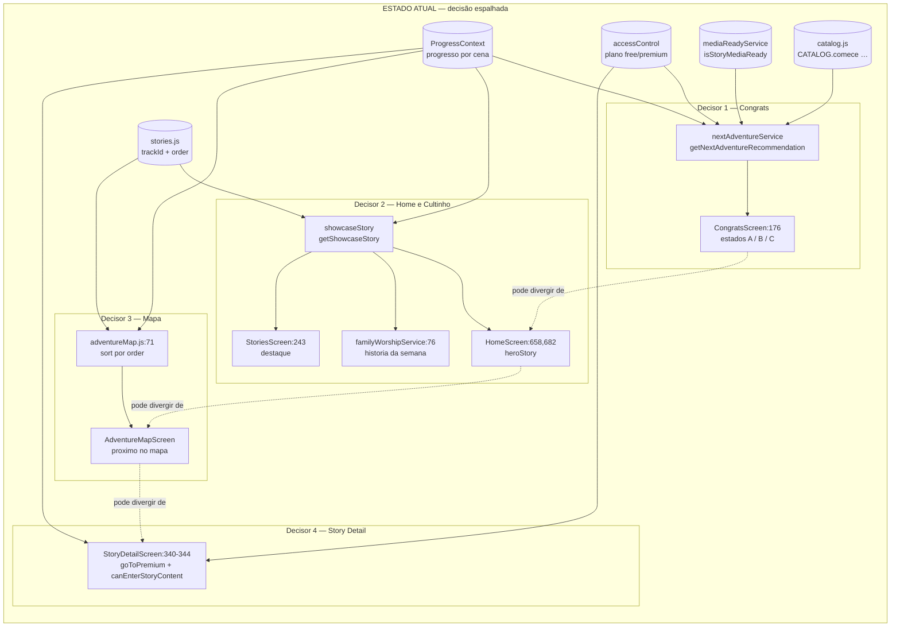
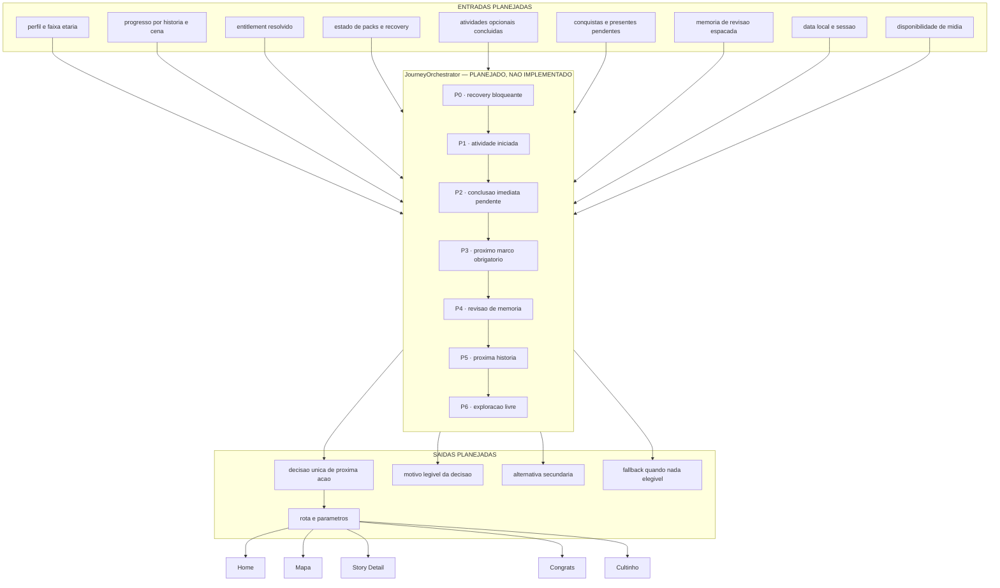

# 02 · Diagrama do JourneyOrchestrator

> **Artefato 2 de 11 — E015 · Fase 3G · Reconciliação**

| Campo | Valor |
|---|---|
| **Estado** | **PRELIMINAR PARA PRODUCT LOCK** |
| **Base auditada** | E009 a E014 |
| **Branch** | `integrate/colorir-canonical-runtime` |
| **HEAD** | `015c438106538595b592981fbe1b80b1d5d65e55` |
| **Data** | 5 de agosto de 2026 |

---

## 0 · Declaração central

> ## JourneyOrchestrator: **PLANEJADO, MAS NÃO IMPLEMENTADO COMO MOTOR CANÔNICO**

**Este artefato não implementa funcionalidade.** Não existe classe, módulo, arquivo JavaScript,
interface ou serviço chamado `JourneyOrchestrator` no HEAD canônico
(`git grep -i journeyorchestrator -- src` → **zero ocorrências**). — `COMPROVADO PELO CÓDIGO`

Os diagramas abaixo são **contratos preliminares**, não módulos implementados. Nenhum código foi
criado, alterado ou preparado por este documento.

---

## 1 · Fontes técnicas principais

| Fonte | Papel hoje |
|---|---|
| `src/services/nextAdventureService.js` | Decide "próxima aventura" — **consumidor único: `CongratsScreen.js:176`** |
| `src/services/showcaseStory.js` | Decide "história vitrine" — consumida por Home, Stories e Cultinho |
| `src/data/catalog.js` | Ordem de trilhas usada pela recomendação (`CATALOG.comece`, `.pequeninos`, …) |
| `src/data/stories.js` | `trackId` + `order` por história (vocabulário `comece_aqui`) |
| `src/data/adventureMap.js:71` | Ordena o mapa por `order` |
| `src/services/mediaReadyService.js` | Filtro de jogabilidade (`isStoryMediaReady`) |
| `src/services/accessControl.js` | Autorização por plano |
| `src/context/ProgressContext.js` | Progresso por história/cena |

---

## 2 · Classificação de evidência

`COMPROVADO PELO CÓDIGO` para tudo que descreve o estado atual.
`PLANEJADO, MAS NÃO IMPLEMENTADO` para todo o contrato proposto.
Nenhuma evidência foi transformada em outra.

---

## 3 · Estado atual — decisão de jornada espalhada

Hoje **não há um decisor único**. Existem, no mínimo, **três respostas concorrentes** à pergunta
"o que vem agora?", cada uma com dono, entrada e vocabulário próprios. — `COMPROVADO PELO CÓDIGO`

### 3.1 · Divergências estruturais comprovadas

| # | Divergência | Evidência |
|--:|---|---|
| 1 | **Dois vocabulários de trilha.** `catalog.js` usa `comece`; `stories.js` usa `trackId: 'comece_aqui'`. As duas listas convivem e nunca se validam mutuamente | `COMPROVADO PELO CÓDIGO` |
| 2 | **Fonte de ordem divergente.** A recomendação pós-história lê a ordem de `CATALOG`; o mapa lê `stories.js:order`; a vitrine usa `(a.order ?? 99)` como desempate | `COMPROVADO PELO CÓDIGO` |
| 3 | **Posição no array ≠ (trackId, order).** Em `stories.js`, `jonah_big_fish` (descobridores #6) ocupa a 6ª posição do array, no meio de `pequeninos`; `esther_queen` (pequeninos #4) ocupa a 13ª, no meio de `descobridores` | `COMPROVADO PELO CÓDIGO` |
| 4 | **`chronologicalOrder` existe em 3 de 20 histórias** (`noah`=3, `david_goliath`=17, `jesus_children`=46). `getStoriesInChronologicalOrder()` subtrai `undefined` nas outras 17 | `COMPROVADO PELO CÓDIGO` |
| 5 | **Helpers de ordenação sem consumidor.** `getStoriesInChronologicalOrder` e `getStoriesByLevelGroupedByCollection` não são importados por nenhuma tela | `IMPLEMENTADO, MAS SEM CONSUMIDOR` |
| 6 | **Congrats é o único consumidor** de `getNextAdventureRecommendation`. Home, Mapa e Story Detail nunca perguntam a ele | `COMPROVADO PELO CÓDIGO` |

> **Consequência preliminar (não é decisão de produto):** a criança pode receber, na mesma sessão,
> três sugestões distintas de "próxima" — uma no Congrats, outra na Home e outra no Mapa — sem que
> nenhuma delas esteja errada isoladamente. Classificação: `INFERÊNCIA`, derivada das divergências 1
> a 6. **Não foi observada em aparelho.**

### 3.2 · Writers e readers do estado de jornada

| Estado | Writers | Readers |
|---|---|---|
| Progresso por cena | `ProgressContext` | Home, Mapa, StoryDetail, Congrats, `nextAdventureService`, `showcaseStory`, Estrelinhas |
| Plano/entitlement | **somente** `entitlementService.saveEntitlement` | `accessControl` → todas as superfícies de conteúdo |
| Conquistas | `achievementService` | Estrelinhas, Congrats, Baú |
| Packs | `packDownloadService` (índice READY) | `PacksContext`, `contentResolver`, StoryDetail |
| Colorir 60 | `coloring60*Service` | Colorir, Coleção, Prévia |
| Presentes | `presentes/baú` | Baú do Beni |
| **Jornada (agregada)** | **não existe** | **não existe** |

---

## 4 · Contrato planejado

### 4.1 · Entradas planejadas

1. Perfil ativo e faixa etária.
2. Progresso por história e por cena.
3. Entitlement **já resolvido** (o orquestrador não decide autorização, apenas a consome).
4. Estado de packs, incluindo recovery pendente.
5. Atividades opcionais concluídas (Quiz, Reflexão, Colorir, Livrinho).
6. Conquistas e presentes pendentes de entrega.
7. Memória de revisão espaçada (**hoje inexistente** — ver artefato 03).
8. Data local e identidade de sessão.
9. Disponibilidade real de mídia (`isStoryMediaReady` ou sucessor).

### 4.2 · Saídas planejadas

1. **Uma** decisão de próxima ação.
2. Motivo legível da decisão (auditável, para depuração e para a Área dos Pais).
3. Alternativa secundária, quando existir.
4. Rota e parâmetros de navegação.
5. Fallback explícito quando nada for elegível.

### 4.3 · Prioridade preliminar

**Preliminar, não congela produto.** A ordem final pertence à Fase 4.

| Nível | Regra | Justificativa preliminar |
|---|---|---|
| **P0** | recovery bloqueante | conteúdo corrompido ou pack incompleto impede qualquer promessa de continuidade |
| **P1** | atividade iniciada | retomar o que a criança já começou tem prioridade sobre abrir algo novo |
| **P2** | conclusão imediata pendente | fechar o laço aberto antes de propor outro |
| **P3** | próximo marco obrigatório | avanço estruturado da trilha |
| **P4** | revisão de memória | consolidação espaçada |
| **P5** | próxima história | progressão editorial |
| **P6** | exploração livre | quando nada acima se aplica |

### 4.4 · Falhas e fallbacks planejados

| Falha | Fallback preliminar |
|---|---|
| Nenhuma história elegível | exploração livre (P6) |
| Entitlement não resolvido | tratar como `free` — **fail-closed**, como hoje (`entitlementPolicy.js:69`) |
| Mídia ausente | excluir a história da recomendação, jamais recomendar e falhar depois |
| Progresso corrompido | degradar para P6 e sinalizar recovery |
| Recovery em curso | P0 permanece até resolver |

---

## 5 · Relações exigidas

### 5.1 · Atividades opcionais
Quiz, Reflexão, Colorir e Livrinho **não bloqueiam** progressão hoje. `StoryDetailScreen.js:337-339`
registra a decisão: *"bloquear a entrada na história nunca fecha o que só leva a ver/consultar"*.
O orquestrador planejado **preserva** essa assimetria. — `COMPROVADO PELO CÓDIGO`

### 5.2 · Presentes, conquistas e revisão
Conquistas e presentes têm writers próprios e overlays próprios. O orquestrador planejado **não os
concede**; apenas ordena sua **apresentação** em relação às demais decisões. Revisão de memória
depende de mecanismo que **não existe** hoje — ver artefato 03.

### 5.3 · Packs e entitlement
O orquestrador planejado **consome** entitlement e estado de pack; **nunca os produz**.
`accessControl.js:47-49` fixa a regra que permanece válida: *"Pack no disco NUNCA é autorização"*.
Mídia local, autorização, cache válido e pack instalado seguem sendo **quatro eixos distintos**.

---

## 6 · Contratos que pertencem à Fase 4

1. Ordem editorial canônica única e reconciliação dos dois vocabulários de trilha.
2. Política de revisão espaçada (janelas, decaimento, teto).
3. Regra de precedência definitiva entre marco obrigatório e revisão.
4. Semântica de "conclusão" de história (cenas vistas × atividades × tempo).
5. Se atividades opcionais passam a compor marco.

## 7 · Implementação proprietária das Fases 9 e 11

A construção efetiva do motor, sua integração às superfícies e a migração dos quatro decisores atuais
pertencem às **Fases 9 e 11**. E015 não as antecipa.

---

## 8 · Decisões já aprovadas que não podem ser reabertas

1. Entitlement **fail-closed**: sem fonte resolvida, o plano é `free`.
2. `saveEntitlement` é o **único** writer de `@ptf_entitlement_v1`.
3. Pack no disco não autoriza acesso.
4. Atividades de consulta não são bloqueadas pelo portão de entrada em conteúdo.

---

## 9 · Itens não determinados

1. Se as três sugestões concorrentes já divergem **na prática** em uma sessão real — não observado
   em aparelho.
2. Custo de migração dos quatro decisores atuais para um motor único.
3. Se `catalog.js` ou `stories.js` deve ser a fonte única de ordem.
4. Comportamento de `getStoriesInChronologicalOrder()` com 17 valores ausentes — a função **não tem
   consumidor**, portanto o efeito nunca se manifesta hoje.

## 10 · Fases proprietárias

| Assunto | Fase |
|---|---|
| Contratos de jornada, ordem canônica, revisão espaçada | **4** |
| Implementação do motor e migração das superfícies | **9 e 11** |
| Reconciliação documental dos vocabulários | **E016** |

---

*Fim do artefato 2 de 11. Nenhum código foi criado.*
