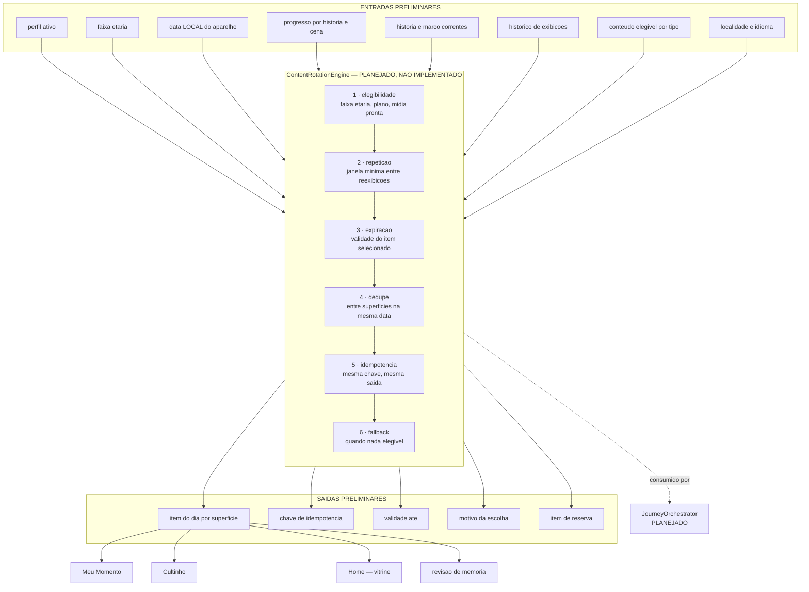

# 03 · Diagrama do ContentRotationEngine

> **Artefato 3 de 11 — E015 · Fase 3G · Reconciliação**

| Campo | Valor |
|---|---|
| **Estado** | **PRELIMINAR PARA PRODUCT LOCK** |
| **Base auditada** | E009 a E014 |
| **Branch** | `integrate/colorir-canonical-runtime` |
| **HEAD** | `015c438106538595b592981fbe1b80b1d5d65e55` |
| **Data** | 5 de agosto de 2026 |

---

## 0 · Declaração central

> ## ContentRotationEngine: **PLANEJADO, MAS NÃO IMPLEMENTADO COMO MOTOR CANÔNICO**

**Este artefato não implementa funcionalidade.** Não existe módulo, classe ou serviço
`ContentRotationEngine` no HEAD canônico. O que existe hoje é **uma única linha de rotação** e
**uma seleção fixa**, descritas abaixo com precisão. — `COMPROVADO PELO CÓDIGO`

---

## 1 · Fontes técnicas principais

| Fonte | Papel |
|---|---|
| `src/screens/LumiMomentScreen.js:18,23` | Única rotação real do aplicativo |
| `src/data/lumiReflections.js` | Conteúdo estático de Meu Momento |
| `src/services/immersiveMoment.js` | Apenas flag de sessão (`isActive`/`begin`/`subscribe`) |
| `src/services/familyWorshipService.js:70-76` | "História da semana" do Cultinho |
| `src/services/showcaseStory.js` | Seleção da história vitrine |
| `src/screens/CultinhoEmCasaScreen.js` | Superfície do Cultinho |

---

## 2 · Estado atual — Meu Momento

### 2.1 · A única rotação existente

```js
// src/screens/LumiMomentScreen.js:18
return Math.floor(Date.now() / 86400000) % listLength;
// :23
const msg = LUMI_MOMENT_MESSAGES[dayIndex(LUMI_MOMENT_MESSAGES.length)];
```

| Propriedade | Estado | Classificação |
|---|---|---|
| Rotação existe | **sim**, diária | `COMPROVADO PELO CÓDIGO` |
| Base temporal | **dia de época UTC** (`Date.now() / 86400000`) | `COMPROVADO PELO CÓDIGO` |
| Data **local** | **não usada** | `COMPROVADO PELO CÓDIGO` |
| Fuso considerado | **nenhum** | `COMPROVADO PELO CÓDIGO` |
| Aleatoriedade | nenhuma — determinística | `COMPROVADO PELO CÓDIGO` |
| Perfil / faixa etária | **não entram** na seleção | `COMPROVADO PELO CÓDIGO` |
| História ou marco relacionado | **não entram** | `COMPROVADO PELO CÓDIGO` |
| Memória do que já foi exibido | **inexistente** | `COMPROVADO PELO CÓDIGO` |
| Dedupe | apenas o módulo do tamanho da lista | `COMPROVADO PELO CÓDIGO` |
| Expiração | implícita: troca ao virar o dia UTC | `COMPROVADO PELO CÓDIGO` |

> **Consequência técnica:** a virada acontece às **00:00 UTC**, que no horário de Brasília
> (UTC−3) corresponde a **21:00 do dia anterior**. Uma criança que abre o app às 21h30 já vê a
> mensagem "de amanhã". Classificação: `COMPROVADO PELO CÓDIGO` quanto ao cálculo;
> `INFERÊNCIA` quanto ao efeito percebido — **não observado em aparelho**.

### 2.2 · Ausência de data local em todo o aplicativo

`git grep -lnE "getDay\(\)|toDateString\(\)|new Date\(\)\.getDate" -- src` → **zero arquivos**.
Não existe nenhuma lógica de data local em `src/`. — `COMPROVADO PELO CÓDIGO`

### 2.3 · `immersiveMoment.js` não rotaciona nada
Expõe apenas `isImmersiveMomentActive`, `beginImmersiveMoment` e `subscribeImmersiveMoment` —
uma flag de sessão. Não seleciona conteúdo. — `COMPROVADO PELO CÓDIGO`

---

## 3 · Estado atual — Cultinho em Casa

```js
// src/services/familyWorshipService.js:70-76
/* Hoje retorna simplesmente a história vitrine (getShowcaseStory). No futuro, … */
return getShowcaseStory();
```

`getShowcaseStory()` (`showcaseStory.js:15-32`) é **determinístico e sem entrada temporal**:

1. filtra histórias jogáveis (`totalCenas > 0`, não `coming_soon`, `isStoryMediaReady`);
2. prefere as `accessType: 'free'`;
3. prioriza `trackId === 'comece_aqui'`;
4. desempata por maior `totalCenas`;
5. desempata por menor `order`.

Com o catálogo atual (2 gratuitas, ambas `comece_aqui`, ambas com 10 cenas, `order` 1 e 2), o
resultado é **invariavelmente `creation` — "A Criação"**. — `COMPROVADO PELO CÓDIGO`

| Propriedade | Estado |
|---|---|
| "História da semana" | **fixa**, não semanal | `COMPROVADO PELO CÓDIGO` |
| Rotação | **nenhuma** | `COMPROVADO PELO CÓDIGO` |
| Sensibilidade a data | **nenhuma** | `COMPROVADO PELO CÓDIGO` |
| Sensibilidade a progresso | **nenhuma** | `COMPROVADO PELO CÓDIGO` |
| Rotação futura | declarada no próprio comentário | `PLANEJADO, MAS NÃO IMPLEMENTADO` |

> **Nota de escopo:** a mesma função alimenta a vitrine da Home (`HomeScreen.js:658,682`), o destaque
> de `StoriesScreen.js:243` e a história do Cultinho. Três superfícies com **a mesma resposta fixa**.

---

## 4 · Ausências comprovadas

| # | Ausência | Evidência |
|--:|---|---|
| 1 | **Recuperação espaçada** — nenhum módulo, chave de storage ou cálculo de intervalo | `COMPROVADO PELO CÓDIGO` |
| 2 | **Memória de última atividade** para fins de rotação — o progresso é registrado, mas nada o consulta para escolher conteúdo | `COMPROVADO PELO CÓDIGO` |
| 3 | **Elegibilidade por faixa etária** na rotação — `storyConstants.js` define 3-6, 6-9 e 9-12, e nenhuma rotação os consulta | `COMPROVADO PELO CÓDIGO` |
| 4 | **Dedupe entre superfícies** — Home, Cultinho e Stories exibem a mesma história sem coordenação | `COMPROVADO PELO CÓDIGO` |
| 5 | **Idempotência declarada** — não há contrato de "mesma entrada, mesma saída" documentado, ainda que o comportamento atual seja determinístico | `INFERÊNCIA` |

---

## 5 · Motor planejado



### 5.1 · Regras preliminares

| Regra | Formulação preliminar |
|---|---|
| **Elegibilidade** | faixa etária compatível · mídia pronta · plano compatível · não `coming_soon` |
| **Repetição** | janela mínima entre reexibições do mesmo item, por superfície |
| **Expiração** | todo item selecionado carrega `validoAte`; expirado força nova seleção |
| **Dedupe** | o mesmo item não ocupa duas superfícies na mesma data local |
| **Idempotência** | chave `(perfil, superfície, dataLocal)` → mesma saída em qualquer releitura |
| **Perfil e faixa** | entram como filtro, nunca como aleatoriedade |
| **História e marco** | conteúdo pode ancorar-se na história corrente |
| **Localidade e data local** | **substituir o dia de época UTC por data local** — hoje é a única rotação e não considera fuso |
| **Privacidade** | seleção **inteiramente local**; nenhuma entrada sai do aparelho |
| **Offline** | motor deve operar sem rede; conteúdo elegível vem do bundle ou de pack instalado |
| **Falha e fallback** | lista vazia → item de reserva fixo; erro de leitura → conteúdo neutro, nunca tela vazia |

### 5.2 · Relação com o JourneyOrchestrator

O `ContentRotationEngine` **fornece candidatos**; o `JourneyOrchestrator` **decide a ação**.
São motores distintos: rotação responde *"qual conteúdo hoje?"*; jornada responde *"o que fazer
agora?"*. Ambos `PLANEJADO, MAS NÃO IMPLEMENTADO`. Ver artefato 02.

---

## 6 · Não congelar

Os **algoritmos editoriais** — quais tipos de conteúdo rotacionam, com que cadência, qual peso
recebe a revisão espaçada e qual a curva de dificuldade — **pertencem à Fase 4** e **não são
congelados aqui**. Este artefato registra apenas o contrato técnico preliminar.

---

## 7 · Decisões já aprovadas que não podem ser reabertas

1. Todo conteúdo de rotação é **local**; não há chamada de rede para selecionar conteúdo.
2. O Cultinho é feature separada do Modo Igreja e segue visível no v1
   (`featureFlags.js:32-33`). — `COMPROVADO PELO CÓDIGO`
3. Vitrine só exibe história **realmente jogável** (nunca "Em breve") — regra B1.

## 8 · Itens não determinados

1. Se a virada às 21h (Brasília) já foi percebida por usuário real — **não observado em aparelho**.
2. Cadência editorial desejada (diária, semanal, por sessão).
3. Tamanho e composição do acervo rotacionável nas Fases 4 e 5.
4. Se a "história da semana" do Cultinho deve divergir da vitrine da Home.

## 9 · Fases proprietárias

| Assunto | Fase |
|---|---|
| Algoritmo editorial, cadência, revisão espaçada | **4** |
| Conteúdo de Cultinho e Meu Momento | **5** |
| Implementação do motor | **9 e 11** |
| Correção da base temporal (UTC → local) | **4** (contrato) · **9** (implementação) |

---

*Fim do artefato 3 de 11. Nenhum código foi criado.*
