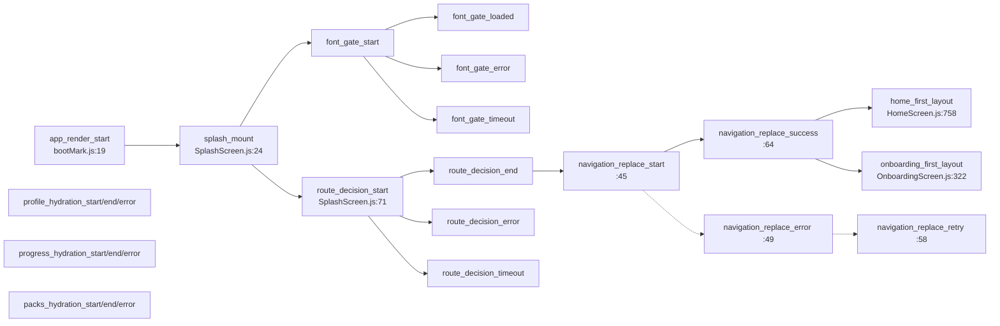

# 06 · Baseline de desempenho

> **Artefato 6 de 11 — E015 · Fase 3G · Reconciliação**

| Campo | Valor |
|---|---|
| **Estado** | **PRELIMINAR PARA PRODUCT LOCK** |
| **Base auditada** | E009 a E014 |
| **Branch** | `integrate/colorir-canonical-runtime` |
| **HEAD** | `015c438106538595b592981fbe1b80b1d5d65e55` |
| **Data** | 5 de agosto de 2026 |

---

## 0 · Declaração de natureza

**Este artefato não implementa funcionalidade e NÃO INVENTA METAS NUMÉRICAS NOVAS.**

Toda cifra registrada aqui tem **origem declarada**. Onde não houve medição, o registro é
`NÃO MEDIDO` — e permanece assim. Nenhum limite, alvo, orçamento ou SLA foi criado por E015.

### 0.1 · As quatro classificações de origem

| Classificação | Significado |
|---|---|
| **`MEDIDO`** | Número obtido por execução de instrumentação ou ferramenta, com registro. |
| **`DOCUMENTADO HISTORICAMENTE`** | Número registrado em documento versionado de bloco anterior. |
| **`DERIVADO POR LEITURA`** | Constante ou comportamento lido no código-fonte — **não é medição**. |
| **`NÃO MEDIDO`** | Nenhuma medição existe. **Não estimar.** |

### 0.2 · Correspondência com a classificação canônica de E015

As quatro classificações acima são **especializações de desempenho**, não um vocabulário paralelo.
Cada uma corresponde a exatamente uma classificação canônica de E015 — a tabela abaixo é
**vinculante** e existe para que E016 não precise inferir a equivalência:

| Classificação local (§0.1) | Classificação canônica de E015 |
|---|---|
| **`MEDIDO`** | `COMPROVADO FISICAMENTE` |
| **`DOCUMENTADO HISTORICAMENTE`** | `COMPROVADO PELO DOCUMENTO` |
| **`DERIVADO POR LEITURA`** | `COMPROVADO PELO CÓDIGO` |
| **`NÃO MEDIDO`** | `NÃO DETERMINADO` |

> **Nenhuma conversão de evidência ocorre nesta tabela.** Ela apenas nomeia a mesma prova nos dois
> vocabulários. `DERIVADO POR LEITURA` continua **não sendo medição**, e `NÃO MEDIDO` continua
> **não sendo estimativa**.

---

## 1 · Fontes técnicas principais

| Fonte | Papel |
|---|---|
| `src/services/performanceTrace.js` | Instrumentador local do boot (LP1M-A / LP1M-B) |
| `src/services/bootMark.js` | Marca `app_render_start` antes de qualquer import pesado |
| `src/screens/SplashScreen.js` | Marcas de decisão de rota e navegação |
| `src/context/{Profile,Progress,Packs}Context.js` | Marcas de hidratação dos três providers |
| `src/screens/HomeScreen.js:758` · `OnboardingScreen.js:322` | Marcas de primeiro layout |
| `docs/F1_2_ESCALA_WEBP_CENAS_CAPAS.md` | Medições de peso de mídia |
| `docs/F1_1_PILOTO_WEBP.md` · `docs/F1_0_AUDITORIA_MIDIA.md` | Auditoria e piloto de mídia |
| `docs/PROJECT_SOURCE_OF_TRUTH.md:38` | Baseline técnico e contagem de smoke |

---

## 2 · Correções metodológicas herdadas de E014

| # | Formulação incorreta | Formulação correta adotada |
|--:|---|---|
| 4 | ~~"Asset entregue por pack = zero."~~ | **Zero payloads de pack versionados no repositório.** O estado de packs **instalados no aparelho** é independente e não foi levantado. |
| 5 | ~~"Zero mídia validada fisicamente."~~ | **Zero auditorias físicas individuais** dos 200 arquivos. **Preservar** as validações físicas históricas dos fluxos que consumiram mídia, packs, áudio e recovery. |

> Consequência para este artefato: os pesos de mídia da §4 medem **o que está no repositório**.
> Não medem o que ocupa espaço num aparelho com packs instalados — isso é `NÃO MEDIDO`.

---

## 3 · A instrumentação que existe

### 3.1 · Cadeia de marcas do boot — `DERIVADO POR LEITURA`

### 3.2 · Constantes lidas no código — `DERIVADO POR LEITURA`

| Constante | Valor | Origem |
|---|---|---|
| `TRACE_BUFFER_LIMIT` | **200** eventos | `performanceTrace.js:20` |
| `TRACE_MAX_META_KEYS` | **4** chaves | `:22` |
| `SAMPLE_SCHEMA` | **1** | `:211` |
| `SAMPLE_PROVIDERS_CEILING_MS` | **3000 ms** | `:213` |
| Intervalo de *polling* da amostra | **100 ms** | `:307`, `:310` |
| `SAMPLE_PREFIX` | `[PTF_PERF_SAMPLE]` | `:209` |

> **Estes números não são metas.** São tetos internos de diagnóstico, já existentes no código.

### 3.3 · Os 9 campos da amostra reproduzível — `DERIVADO POR LEITURA`

`buildSample()` (`:238-268`) produz: `schema`, `route`, `fontReason`, `routeReason`,
`fontGateMs`, `routeDecisionMs`, `splashReactMs`, `firstLayoutMs`, `profileHydrationMs`,
`progressHydrationMs`, `packsHydrationMs`, `bufferDropped`.

**Regra crítica já implementada:** o que não foi medido sai como `null` — *"ausente = null, nunca
inventado"* (`:227`, verbatim). Esta baseline segue a mesma regra.

---

## 4 · Os 20 itens da baseline

### Bloco I — Boot e inicialização

#### 1 · Tempo total de boot até primeiro layout
`NÃO MEDIDO`. A instrumentação existe (`firstLayoutMs`) e emite uma linha por processo, mas
**nenhuma amostra coletada foi encontrada em documento versionado**. Não estimar.

#### 2 · Gate de fontes (`fontGateMs`)
`NÃO MEDIDO`. Instrumentado com três terminais possíveis (`loaded`/`error`/`timeout`).
Nota técnica `DERIVADO POR LEITURA`: o terminal é o de **menor `t`**, não o primeiro da lista —
decisão explícita para que um `_end` tardio não esconda o `_timeout` que de fato governou o boot
(`:168-174`).

#### 3 · Decisão de rota (`routeDecisionMs`)
`NÃO MEDIDO`. Instrumentado em `SplashScreen.js:71`.

#### 4 · Splash React, montagem até `replace` (`splashReactMs`)
`NÃO MEDIDO`. Instrumentado entre `splash_mount` e `navigation_replace_success`.

#### 5 · Retentativa de navegação
`DERIVADO POR LEITURA`: existe caminho de retentativa com contador `attempt`
(`SplashScreen.js:45,49,58`). Frequência real de falha: `NÃO MEDIDO`.

#### 6 · Hidratação do perfil (`profileHydrationMs`)
`NÃO MEDIDO`. Instrumentado em `ProfileContext.js:27-31`.

#### 7 · Hidratação do progresso (`progressHydrationMs`)
`NÃO MEDIDO`. Instrumentado em `ProgressContext.js:187-213`.

#### 8 · Hidratação dos packs (`packsHydrationMs`)
`NÃO MEDIDO`. Instrumentado em `PacksContext.js:105-128`.

#### 9 · Teto de espera dos providers
`DERIVADO POR LEITURA`: **3000 ms**, e a espera **adia apenas a impressão da amostra — não
bloqueia o app** (`:212-213`, `:300`). Quantas execuções atingem o teto: `NÃO MEDIDO`.

### Bloco II — Peso de mídia

#### 10 · Conversão WebP de cenas e capas
`DOCUMENTADO HISTORICAMENTE` (`F1_2_ESCALA_WEBP_CENAS_CAPAS.md:34-37`):

| Lote | Antes | Depois | Variação |
|---|---|---|---|
| Cenas (18 histórias, 180 arquivos) | 401.7 MB | **29.4 MB** | **−93%** |
| Capas (18) | 33.9 MB | **2.6 MB** | **−92%** |
| **Lote F1.2 total** | **435.5 MB** | **31.9 MB** | **−93%** |

#### 11 · Peso total de `assets/`
`DOCUMENTADO HISTORICAMENTE`: **860 MB → 456 MB** no bloco F1.2 (−404 MB); acumulado desde o
início **−452 MB / −50%** (`:13`, `:37`).

#### 12 · Média por arquivo
`DOCUMENTADO HISTORICAMENTE`: cena **~167 KB**, capa **~146 KB** (`:15-16`, `:39`).

#### 13 · Orçamento de cena
`DOCUMENTADO HISTORICAMENTE`: faixa **150–400 KB**; **todas as cenas dentro** (`:15`, `:90`).
**Este orçamento é preexistente — E015 não o criou nem o alterou.**

#### 14 · Capas fora da faixa preferencial
`DOCUMENTADO HISTORICAMENTE` (`:91`): **4 capas** acima de 200 KB — `jonas_peixe` 308 KB,
`jesus_children` 264 KB, `jose_tunica` 243 KB, `moises_mar_vermelho` 225 KB. Ainda **~90%
menores** que os PNG originais (1.5–2.7 MB). Registrado como **aceitável, sem urgência**.

#### 15 · Colorir — o maior peso local restante
`DOCUMENTADO HISTORICAMENTE` (`:103`, `:140`): **278 MB em PNG** dentro de `assets/stories`
(313 MB). **200 PNG, 0 WebP.** `coloringImages.js` intocado.
Condição registrada para otimizar (`:131`): substituir pelas páginas refinadas, **validar flood
fill em aparelho**, e **só então** otimizar — **"sem lossy sem teste específico"**.

#### 16 · Peso ocupado no aparelho com packs instalados
`NÃO MEDIDO`. **Correção 4 de E014 aplicada:** o repositório não versiona payload de pack; o
espaço ocupado por packs instalados é eixo independente e não foi levantado.

### Bloco III — Runtime e execução

#### 17 · Desempenho de renderização (FPS, *jank*, listas)
`NÃO MEDIDO`. Não há instrumentação de quadro no código. Nenhuma medição documentada.

#### 18 · Desempenho do canvas (Ateliê e Colorir)
`NÃO MEDIDO` numericamente. `DOCUMENTADO HISTORICAMENTE`: existem **validações físicas de fluxo**
registradas para Ateliê/Colorir (`docs/C60_VALIDACAO_FISICA.md`, `docs/ATELIER_GUIDE.md`).
**Correção 5 de E014 aplicada:** validação física de **fluxo** existe e é preservada; o que não
existe é auditoria física **individual por arquivo** e medição numérica de latência de traço.

#### 19 · Áudio — latência de início e continuidade
`NÃO MEDIDO`. `DOCUMENTADO HISTORICAMENTE`: fluxos de áudio tiveram validação física de fluxo.
Nenhum número de latência foi registrado.

#### 20 · Suíte de verificação
`DOCUMENTADO HISTORICAMENTE` (`PROJECT_SOURCE_OF_TRUTH.md:38`): baseline técnico em
`fix/loading-performance-foundation` @ `aeda9c2`, tag `lp-foundation-closed-2026-07-30` → `bc79edb`,
**smoke 3314/3314**.
**Nota de escopo E015:** este artefato é documental; `npm run smoke` e `expo-doctor`
**não foram executados** nesta etapa — não há código a testar.

---

## 5 · Resumo por classificação

| Classificação | Itens | Total |
|---|---|---:|
| **`MEDIDO`** nesta etapa | — nenhum. E015 é documental e **não executou medição**. | **0** |
| **`DOCUMENTADO HISTORICAMENTE`** | 10, 11, 12, 13, 14, 15, 18 (parcial), 19 (parcial), 20 | **9** |
| **`DERIVADO POR LEITURA`** | 2 (nota), 5, 9, §3.2, §3.3 | **5** |
| **`NÃO MEDIDO`** | 1, 2, 3, 4, 6, 7, 8, 16, 17, 18 (numérico), 19 (numérico) | **11** |

> **Leitura honesta da baseline:** o boot está **instrumentado mas não amostrado**. Existe
> ferramenta pronta (`emitSummaryOnce`, prefixo fixo, schema versionado) e **nenhuma coleta
> registrada**. Esta é a lacuna mais relevante do artefato.

---

## 6 · O que este artefato **não** faz

1. **Não cria meta numérica.** Nenhum "boot deve ser < X ms", nenhum novo orçamento de bytes.
2. **Não converte `NÃO MEDIDO` em estimativa.**
3. **Não declara aprovação de desempenho** em nenhum aparelho — ver artefato 07.
4. **Não executa medição.** E015 é documental.

---

## 7 · Decisões já aprovadas que não podem ser reabertas

1. **Medir antes de otimizar** — Constituição, Princípio IV, citado em `performanceTrace.js:4`.
2. **Diagnóstico não pode quebrar o app** — instrumentação nunca lança, nunca faz `setState`,
   não altera o que mede (`:12-16`).
3. **Colorir não recebe lossy sem teste específico de flood fill em aparelho**
   (`F1_2:131`).
4. **Orçamento de cena 150–400 KB** permanece como registrado em F1.2.

## 8 · Itens não determinados

1. Todo o perfil temporal do boot em aparelho real.
2. Desempenho de renderização e de canvas em números.
3. Espaço ocupado por packs instalados.
4. Se a amostra `[PTF_PERF_SAMPLE]` já foi coletada alguma vez em aparelho físico.

## 9 · Fases proprietárias

| Assunto | Fase |
|---|---|
| Definição de metas de desempenho | **4** |
| Otimização final de Colorir (F1.3) | **5** |
| Coleta de baseline em aparelho | **9** |
| Otimização de runtime e listas | **11** |

---

*Fim do artefato 6 de 11. Nenhuma medição foi executada e nenhuma meta numérica foi criada.*
